<picture>
  <source media="(prefers-color-scheme: dark)" srcset="./assets/header-dark.svg">
  <source media="(prefers-color-scheme: light)" srcset="./assets/header-light.svg">
  
</picture>

---

Construyo sistemas de IA que llegan a producción, no maquetas. Trabajo del modelo al
dispositivo: pipelines en PyTorch/CUDA, inferencia local con Ollama, APIs en FastAPI y apps
Android nativas. Cada pieza sale con control de calidad ISO/IEC 25000 de extremo a extremo.

> Del modelo al dispositivo.

## Sistemas

| Proyecto | Qué resuelve | Stack |
| --- | --- | --- |
| **[SHelpDesk](https://sistemahelpdesk.online)** · [código](https://github.com/sebasdeasturias/SHelpDeskMicrosoft) | Mesa de ayuda que clasifica tickets con IA local, resuelve en Kanban y reutiliza el conocimiento ya resuelto mediante búsqueda semántica. | FastAPI · n8n · Ollama · PostgreSQL |
| **[Genoly-GPU](https://github.com/SebasAstrea/Genoly-GPU)** | Pipeline genómico acelerado por GPU: FASTA/FASTQ, control de calidad, alineamiento y llamada de variantes. | PyTorch · CUDA |
| **[Vision-RT](https://github.com/SebasAstrea/Vision-RT)** | App Android de asistencia visual: detecta obstáculos, resume objetos y lee texto, con todo el procesamiento en el dispositivo. | Kotlin |
| **[RAG portable](https://github.com/SebasAstrea/port-rag-potty)** | RAG con Ollama y ChromaDB que sirve contexto curado a agentes de IA y baja la sesión de onboarding de 18–42k a 6–9k tokens. | Python · FastAPI · ChromaDB |

## Herramientas

**IA y datos** — PyTorch · Keras · TensorFlow · CUDA · Ollama · ChromaDB
**Backend y apps** — Python · FastAPI · Kotlin · PostgreSQL
**Infraestructura** — Docker · Nginx · Cloudflare · n8n

## Cómo trabajo

- **Producción sobre demos.** Lo que no corre y no se puede medir no está terminado.
- **IA local y privada.** Prefiero la inferencia en el hardware del usuario antes que depender de la nube.
- **Calidad de extremo a extremo.** ISO/IEC 25000, del requerimiento al mantenimiento.
- **Ingeniería asistida por agentes.** Automatizo el contexto y la verificación; deciden los gates, no la intuición.

## Enlaces

[Portafolio · CV](https://sebasastrea-cv.vercel.app) · [LinkedIn](https://linkedin.com/in/sebasastrea) · [GitHub](https://github.com/SebasAstrea)
